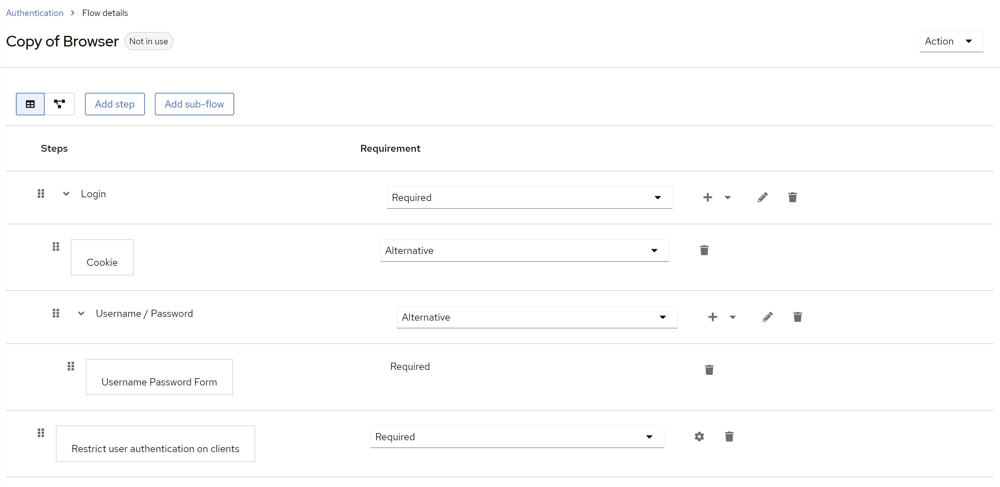
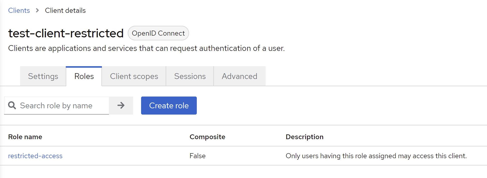

# Keycloak: Authenticator - Restrict user authentication on client


This is a simple Keycloak authenticator to restrict user authentication to client.

## What is it good for?
Every now and then I get asked whether it is possible to restrict user authentication for certain clients.

Generally the question goes like this

> Is it possible to allow specific users to authenticate to a client, while reject others?

As of today, my general answer is _"no, at least not out of the box"_. And in general my advice is to redesign and relocate the policy enforcement point (PEP).
However, since this question popped up so often, I wrote this simple authenticator to support this functionality.

### Why not use "Allow/Deny Access" authenticators with conditions?
With Keycloak 13 two new authenticators have been added, namely `Allow Access` and `Deny Access`. Together with `Condition - User Role` authenticator authentication may be restricted in a similar way with out-of-the-box features. So, the question is why not use that and override authentication flows on a per client basis?

Here are some reasons/thoughts
* It is not really flexible. Since `Condition - User Role` only allows for checking one concrete (realm or client-specific) role, a very complex flow handling all clients, or a totally separate flow for each individual client would be needed. 
* It simply does not work well with federated authentication (ie. identity provider redirects), since there is no way to configure client specific behaviour for `First login flow` or `Post login flows`. In other words, there is no feature like `Authentication flow overrides` at an IdP level. Hence, the same flow will be used for all clients. As said before, this becomes very complicated.

## How does it work?
The authenticator uses client roles to restrict authentication. It works like this:

* The authenticator checks whether a client defines a role named `restricted-access`
    * If it does the authenticator checks whether the user has that role
        * If it does, the authenticator returns success (i.e. authentication is successful)
        * If it does not, the authenticator returns failure (i.e. authentication is unsuccessful)
    * If it does not, the authenticator returns success (i.e. authentication is successful).

This means that you can enable the feature by adding a client role to your client named `restricted-access`.
A client with that role has the feature enabled. Only users with that role can authenticate to that client.

## How to install?

Download a release (*.jar file) that works with your Keycloak version from the [list of releases](https://github.com/sventorben/keycloak-restrict-client-auth/releases).

Drop the file to `standalone/deployments` folder to make use of Keycloak Deployer. For details please refer to the [official documentation](https://www.keycloak.org/docs/latest/server_development/#registering-provider-implementations).

For Docker-based setups follow the [guidelines for adding custom providers](https://github.com/keycloak/keycloak-containers/tree/master/server#user-content-adding-a-custom-provider).

> ℹ️ **Maven/Gradle**:
>
> Packages are being released to GitHub Packages. You find the coordinates [here](https://github.com/sventorben?tab=packages&repo_name=keycloak-restrict-client-auth)! It may happen that I remove older packages without prior notice, because the storage is limited on the free tier.


## How to configure?

First, you need to add the authenticator to your desired flow. Mark the authenticator as `Required`. Bind your newly created flow as desired - either as a default for the whole realm or on a per-client basis.

See the image below for an example.



> ⚠️ **User identity**:
>
> The authenticator needs a user identity to check whether the user has the desired role or not. Hence, ensure that you have steps/executions in your flow prior to this authenticator that can ensure user's identity.

Second, you need to add a role named `restricted-access` to the client you want to restrict access to.

See the image below for an example.



Afterwards, no user can authenticate to this client. To allow a user to authenticate, you need to assign the role `restricted-access` to the user. You may do so either by assigning the role to the user directly or via groups or combined roles.

## How to change the role name?

You do not like the role name or you do have some kind of naming conventions in place? You can change the role name globally by configuring the provider.

### via CLI:
```
/subsystem=keycloak-server/spi=authenticator/:add
/subsystem=keycloak-server/spi=authenticator/provider=restrict-client-auth-authenticator/:add(properties={clientRoleName=my-custom-role-name},enabled=true)
```

### via standalone.xml:
```XML
<spi name="authenticator">
    <provider name="restrict-client-auth-authenticator" enabled="true">
        <properties>
            <property name="clientRoleName" value="my-custom-role-name"/>
        </properties>
    </provider>
</spi>
```

For details, please refer to [Manage Subsystem Configuration](https://www.keycloak.org/docs/latest/server_installation/index.html#manage-subsystem-configuration) section in the server installation guide.

## Does it work with Keycloak version X.Y.Z?

If you are using Keycloak version `X` (e.g. `X.y.z`), version `X.b.c` should be compatible.
Keycloak SPIs are quite stable. So, there is a high chance this authenticator will work with other versions, too. Check the details of latest [build results](https://github.com/sventorben/keycloak-restrict-client-auth/actions/workflows/buildAndTest.yml) for an overview or simply give it a try.

Authenticator version `X.b.c` is compiled against Keycloak version `X.y.z`. For example, version `12.3.1` will be compiled against Keycloak version `12.y.z`.

I do not guarantee what version `a.b` or `y.z` will be. Neither do I backport features to older version, nor maintain any older versions of this authenticator. If you need the latest features or bugfixes for an older version, please fork this project or update your Keycloak instance. I recommend doing the latter on regular basis anyways.
